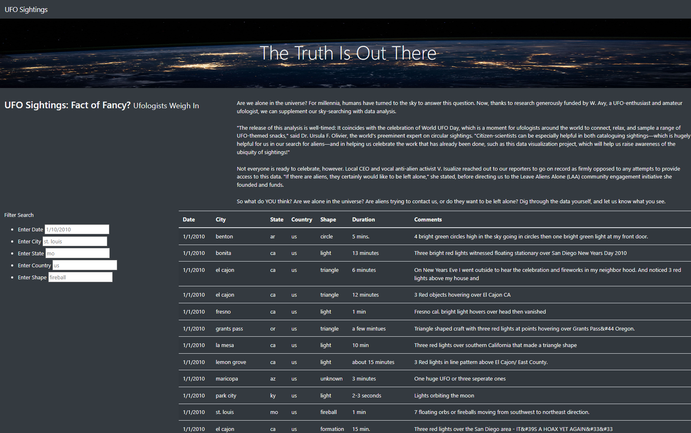
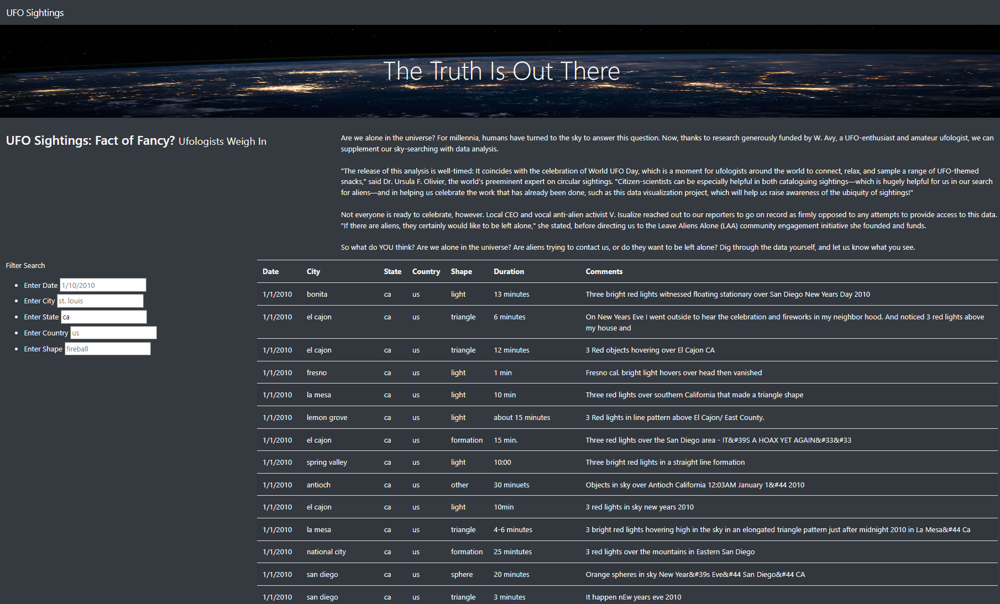
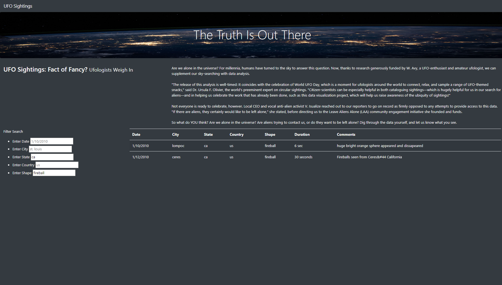

# Tracking UFOs with Javascript

<div align="center">
    
</div>

## <div align="center">Build a Webpage that Helps Enthusiasts Track UFO Activity using Javascript, HTML & CSS</div>

<p align="center">
<a href="#goals">Goals</a> &nbsp;&bull;&nbsp;
<a href="#dataset">Dataset</a> &nbsp;&bull;&nbsp;
<a href="#tools-used">Tools Used</a> &nbsp;&bull;&nbsp;
<a href="#analysis-and-challenges">Analysis and Challenges</a> &nbsp;&bull;&nbsp;
<a href="#results">Results</a> &nbsp;&bull;&nbsp;
<a href="#summary">Summary</a>
</p>

# <div align="center">Goals</div>

After helping build a webpage with a dynamic table containing UFO data, the client wants to expand the search functionality to more categories. I plan to use the following languages to create/modify the webpage and import the data contained in the javascript file:

- HTML
- Javascript
- CSS

These tools will add in-depth analysis of UFO sightings by allowing users to filter for multiple criteria at the same time. I'll build this table using data stored in a JavaScript array with filters to make this table fully dynamic, meaning that it will react to user input, and then place the table into an HTML file for easy viewing. Finally, I'll customize the webpage using Bootstrap, and equip the table with several fully functional filters that will allow users to interact with our visualizations.

# <div align="center">Dataset</div>

High level explanation of data source

- [Data Set File Name:](data/data_source.format) Explain source of file, size of dataset and format

# <div align="center">Tools Used</div>
- **Javascript:** Programming language used for creating visually appealing and dynamic web content
- **HTML:** Hypertext Markup Language used to build and design webpages
- **CSS:** Creative Style Sheets add dynamic visual styling to html webpages


# <div align="center">Analysis and Challenges</div>

Because I had to account for multiple search criteria, I took the following steps to modify our app.js:

1. Created an object to store any entered search terms

```javascript
// 1. Create a variable to keep track of all the filters as an object.
let filters = {};
```

2. Build a function to loop through the filters object and rebuild the table:

```javascript
// 7. Use this function to filter the table when data is entered.
function filterTable() {
  

  // 8. Set the filtered data to the tableData.
  let filteredData = tableData;

  // 9. Loop through all of the filters and keep any data that
  // matches the filter values
  Object.entries(filters).forEach(([key, val]) => {
    filteredData = filteredData.filter(row=> row[key] === val);
  });

  // 10. Finally, rebuild the table using the filtered data
  buildTable(filteredData);
}
```
3. Replaced the d3 event with the following in order to capture any changes since we got rid of the 'filter' button:

```javascript
// 2. Attach an event to listen for changes to each filter
d3.selectAll("input").on("change", updateFilters);
```

# <div align="center">Results</div>

This webpage would be perfect for planning a UFO sighting adventure. The filters allow for a user to plan an itinerary by filtering States, Cities, etc.

Here's how my complete set looks:



If we want to help an UFO enthusiast plan a quick trip to any fireball sightings in California, we can first filter by state ('ca'):



We can then filter by shape ('fireball'):



Presto! We have a roadtrip!

# <div align="center">Summary</div>

This webpage presents a very useful way to navigate the extensive dataset of UFO sightings over the years. One big drawback to the changes we've made is the absesnse of any buttons on the page. Here are some slight tweaks we're suggesting to improve user experience:

- Add a 'Clear Search' button in the index.html file below our filter table, with accompanying javascript that will clear our filters on the event of a button click. This will allow an easy way for the end user to perform multiple queries without having to reload the page
- Allow the user to sort the table by each column. We can accomplish this by adding a sort form under the filter form on the left hand side with input boxes asking for the column and whether they want ascending or descending order

[Back to top](#tracking-ufos-with-javascript)
